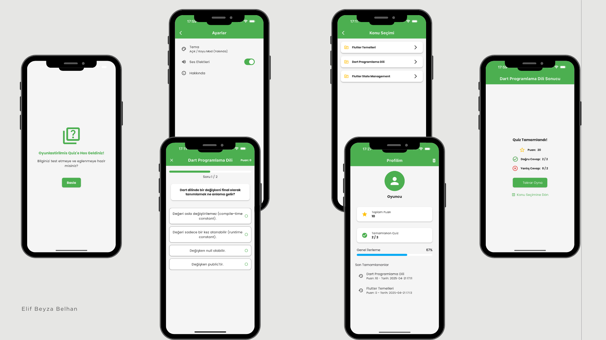

# Gameified Quiz App

## Overview

This is a Flutter-based mobile application developed as a portfolio project. It's a gameified quiz application designed to test knowledge on specific topics (e.g., Flutter widgets) in an engaging way. The app incorporates scoring, local progress tracking, smooth animations, and a fluid user experience.

## Features

*   **Topic Selection:** Choose from available quiz topics.
*   **Interactive Quiz:** Answer questions sequentially with visual feedback.
*   **Scoring:** Track your score during the quiz.
*   **Results:** View your performance after completing a quiz (score, correct/incorrect answers).
*   **Progress Tracking:** Locally saves and displays user progress (completed quizzes, scores).
*   **Engaging UI/UX:** Smooth animations for transitions and interactions (e.g., correct/wrong answer feedback).
*   **Theme Support:** Includes both light and potentially dark themes.
*   **Navigation:** Uses `go_router` for declarative routing.

## Technology Stack

*   **Platform:** Flutter
*   **Language:** Dart
*   **State Management:** Provider / Riverpod / Bloc (Select one based on final implementation)
*   **Local Storage:** `shared_preferences`
*   **Routing:** `go_router`
*   **Styling:** Custom Theming, `google_fonts`
*   **Animations:** Flutter built-in animations, potentially `lottie`

## Screenshots



## Getting Started

1.  **Clone the repository:**
    ```bash
    git clone <your-repository-url>
    cd gameified_quiz
    ```
2.  **Install dependencies:**
    ```bash
    flutter pub get
    ```
3.  **Run the app:**
    ```bash
    flutter run
    ```

## Project Structure (Simplified)

```
lib/
├── main.dart
├── core/          # Core elements (constants, theme, navigation, utils)
├── data/          # Data layer (models, datasources, repositories)
├── presentation/  # UI layer (providers/blocs, screens, widgets, animations)
└── services/      # External service interactions (if any)
```
*(Refer to `.cursor/project_protocol.md` for a more detailed structure)*

## Future Enhancements (Potential)

*   Firebase integration for cloud storage and leaderboards.
*   Time limits for questions or quizzes.
*   Sound effects.
*   More diverse quiz topics.
*   Enhanced profile statistics.

---
